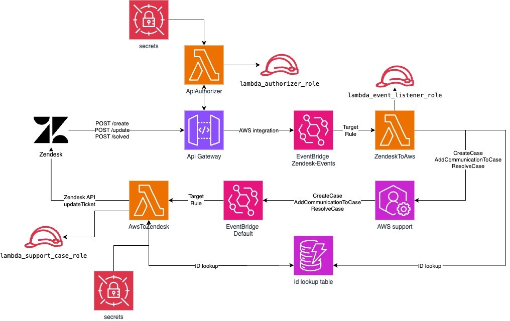

## zendesk-aws-support-conector


### Project Description
 
The zendesk-aws-support-conector project seamlessly integrates Zendesk with AWS, automating customer support workflows and enhancing case management. By leveraging serverless architecture, it ensures efficient synchronization between support tickets and AWS events, providing robust, secure, and scalable solutions. Ideal for organizations looking to streamline their customer service operations and maintain high responsiveness in cloud environments.

---

### Project Architecture 



## Getting Started

### Prerequisites

Before getting started with zendesk-aws-support-conector, ensure your runtime environment meets the following requirements:

- **Programming Languages:** Terraform & Python 3
- **AWS Support Plan:** Business, Enterprise On-Ramp, or Enterprise Support plan (required for AWS Support API access)
- **Zendesk Account:** With administrator access

## Project Structure

Below is the directory structure of the project:

```
.
├── assets                          # Images and other assets
├── lambdas                         # AWS Lambda functions
│   ├── api_authorizer              # API Gateway authorizer Lambda
│   ├── aws_to_zendesk              # Lambda for AWS → Zendesk integration
│   ├── shared                      # Shared code used across Lambda functions
│   └── zendesk_to_aws              # Lambda for Zendesk → AWS integration
├── platform                        # Terraform infrastructure code
│   ├── modules                     # Terraform modules
│   │   ├── api                     # API Gateway resources
│   │   ├── events                  # EventBridge resources
│   │   ├── lambda                  # Lambda functions resources
│   │   ├── queues                  # SQS queues resources
│   │   ├── security                # Security resources (KMS, Secrets Manager)
│   │   └── storage                 # Storage resources (DynamoDB)
│   └── policies                    # IAM policies templates
├── scripts                         # Utility scripts
│   ├── verify_token_security.py    # Token security validation
│   ├── zendesk_configuration.py    # Zendesk setup script
│   └── zendesk_oauth_config.py     # Zendesk OAuth configuration
├── Makefile                        # Build and deployment automation
├── requirements.txt                # Python dependencies
└── README.md                       # Project documentation
```

### Terraform deployment

Install zendesk-aws-support-conector using the following methods:

1. **Clone the zendesk-aws-support-conector repository**

```sh
git clone this repo
```

2. **Navigate to the project directory:**

```sh
cd sample-zendesk-aws-support-conector
```

3. **Copy the example configuration file [`platform/tofill.auto.tfvars.example.json`](./platform/tofill.auto.tfvars.example.json) to `platform/tofill.auto.tfvars.json` and fill in the required variables:**

```sh
cp platform/tofill.auto.tfvars.example.json platform/tofill.auto.tfvars.json
```

4. **Edit the `platform/tofill.auto.tfvars.json` file with your specific configuration values:**

```json
{
  "region": "<region>", // AWS region
  "zendesk_subdomain": "<your_subdomain>", // Example: URL="https://companyname.zendesk.com" then subdomain="companyname"
  "zendesk_admin_email": "<your_admin_email>", // Example: "admin@companyname.com"
  "zendesk_token": "<your_api_key>",    // From Zendesk Admin Panel
  "bearer_token": "Bearer <your_token>", // token generated by you
  "default_tags": {
    "Project": "zendesk-aws-support-conector", // Tag example 1
    "Environment": "production", // Tag example 2
    ...
  }
}
```

5. **Install dependencies and deploy the project:**

```sh
make install
make zendesk_oauth
make zip
make init
make deploy
```

OR

```sh
make all
```

### Zendesk configuration

1. **Enable Zendesk Help Center, as explained in this [Zendesk guide](https://support.zendesk.com/hc/en-us/articles/5702269234330-Enabling-and-activating-your-help-center).**

2. **Install Python dependencies for Zendesk script execution:**

```sh
pip3 install requests boto3
```

2. **Execute the following commands to configure Zendesk through API:**

```sh
make zendesk_setup
```

3. **Access the created form through the browser using the output URL from last step:**
```
https://<domain>.zendesk.com/hc/requests/new?ticket_form_id=<form_id>
```

## Security

See [CONTRIBUTING](CONTRIBUTING.md#security-issue-notifications) for more information.

## License

This library is licensed under the MIT-0 License. See the LICENSE file.
