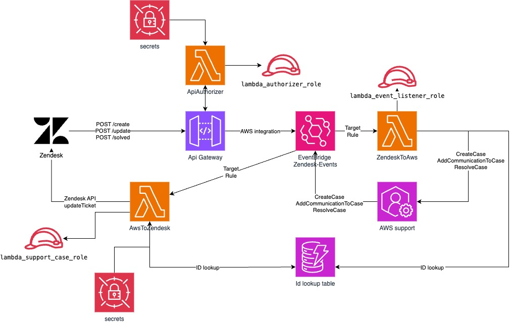

## zendesk-aws-support-connector


### Project Description
 
The zendesk-aws-support-connector project integrates Zendesk with AWS, automating customer support workflows and improving case management. This serverless architecture synchronizes support tickets with AWS events, delivering robust, secure, and scalable solutions. Organizations use this connector to streamline customer service operations and maintain responsiveness in cloud environments.

---

### Project Architecture 



## Getting Started

### Prerequisites

Before using zendesk-aws-support-connector, verify your runtime environment meets these requirements:

- **Programming Languages:** Terraform & Python 3
- **AWS Support Plan:** Business, Enterprise On-Ramp, or Enterprise Support plan (required for AWS Support API access)
- **Zendesk Account:** With administrator access
- **AWS Region:** AWS Support is a global service. To receive updates for your support cases, you can use one of the following regions: US East (N. Virginia) Region, US West (Oregon) Region or Europe (Ireland) Region.

## Project Structure

The project follows this directory structure:

```
.
├── assets                          # Images and other assets
├── lambdas                         # AWS Lambda functions
│   ├── api_authorizer              # API Gateway authorizer Lambda
│   ├── aws_to_zendesk              # Lambda for AWS → Zendesk integration
│   ├── shared                      # Shared code used across Lambda functions
│   ├── utils                       # Utility functions
│   └── zendesk_to_aws              # Lambda for Zendesk → AWS integration
├── platform                        # Terraform infrastructure code
│   ├── modules                     # Terraform modules
│   │   ├── api                     # API Gateway resources
│   │   ├── events                  # EventBridge resources
│   │   ├── lambda                  # Lambda functions resources
│   │   ├── queues                  # SQS queues resources
│   │   ├── security                # Security resources (KMS, Secrets Manager)
│   │   └── storage                 # Storage resources (DynamoDB)
│   └── policies                    # IAM policies templates
├── scripts                         # Utility scripts
│   ├── generate_secure_token.py    # Script to generate secure API tokens
│   ├── verify_token_security.py    # Token security validation
│   ├── zendesk_configuration.py    # Zendesk setup script
│   └── zendesk_oauth_config.py     # Zendesk OAuth configuration
├── Makefile                        # Build and deployment automation
├── requirements.txt                # Python dependencies
└── README.md                       # Project documentation
```

### Terraform deployment

Install zendesk-aws-support-connector using these methods:

1. **Clone the zendesk-aws-support-connector repository**

```sh
git clone this repo
```

2. **Navigate to the project directory:**

```sh
cd sample-zendesk-aws-support-connector
```

3. **Copy the example configuration file [`platform/tofill.auto.tfvars.example.json`](./platform/tofill.auto.tfvars.example.json) to `platform/tofill.auto.tfvars.json` and fill in the required variables:**

```sh
cp platform/tofill.auto.tfvars.example.json platform/tofill.auto.tfvars.json
```

4. **Edit the `platform/tofill.auto.tfvars.json` file with your specific configuration values:**

```json
{
  "region": "<region>", // AWS region
  "zendesk_subdomain": "<your_subdomain>", // Example: URL="https://companyname.zendesk.com" then subdomain="companyname"
  "zendesk_admin_email": "<your_admin_email>", // Example: "admin@companyname.com"
  "zendesk_token": "<your_api_key>",    // From Zendesk Admin Panel
  "bearer_token": "Bearer <your_token>", // API authorization token
  "default_tags": {
    "Project": "zendesk-aws-support-connector", // Tag example 1
    "Environment": "production", // Tag example 2
    ...
  }
}
```

> **Note about API Authorization Token:** You have two options for the `bearer_token`:
> 1. **Generate a secure token automatically:** Run `make init` which will generate a cryptographically secure token and update your configuration file.
> 2. **Use your own token:** You can specify your own token in the format `"Bearer your-token-here"`. If you choose this option, token security is your responsibility. Ensure it's sufficiently complex and kept confidential.
>
> The token is used to authorize API calls to the AWS Support connector and should be treated as a sensitive credential.

5. **Install dependencies and deploy the project:**

```sh
make install
make zendesk_oauth
make zip
make init
make deploy
```

OR

```sh
make all
```

### Zendesk configuration

1. **Enable Zendesk Help Center, as explained in this [Zendesk guide](https://support.zendesk.com/hc/en-us/articles/5702269234330-Enabling-and-activating-your-help-center) - verify only authorized users can access your form.**

2. **Install Python dependencies for Zendesk script execution:**

```sh
pip3 install requests boto3
```

2. **Execute the following commands to configure Zendesk through API:**

```sh
make zendesk_setup
```

3. **Access the created form through the browser using the output URL from last step: (verify your end-users can access your help-center)**
```
https://<domain>.zendesk.com/hc/requests/new?ticket_form_id=<form_id>
```

### Testing the Deployment

After deploying the solution, you can test if it's working correctly by creating and resolving a test support case using the following curl commands:

1. **Create a test support case:**

```bash
curl -X POST \
  https://<api-id>.execute-api.<region>.amazonaws.com/production/create \
  -H 'Content-Type: application/json' \
  -H 'Authorization: Bearer <your_token>' \
  -d '{
    "zd_ticket_id": "12345",
    "zd_ticket_subject" : "TEST CASE - Please ignore",
    "zd_ticket_sev_code": "low",
    "zd_ticket_impacted_service": "amazon-elastic-compute-cloud-linux",
    "zd_ticket_category_code": "other",
    "zd_ticket_desc": "TEST CASE - Please ignore"
  }'
```

After executing this command, **verify the case creation** by checking the AWS Support Center Console (https://console.aws.amazon.com/support/home) to confirm that a new support case has been created with the details you provided.

2. **Resolve the test support case:**

```bash
curl -X POST \
  https://<api-id>.execute-api.<region>.amazonaws.com/production/solved \
  -H 'Content-Type: application/json' \
  -H 'Authorization: Bearer <your_token>' \
  -d '{
    "zd_ticket_id": "12345"
  }'
```

After executing this command, **verify the case resolution** by checking the AWS Support Center Console again. The status of the case should now be "Resolved".

Replace the following placeholders:
- `<api-id>`: The API Gateway ID from your deployment output
- `<region>`: Your AWS region (from your tfvars file)
- `<your_token>`: The token value you configured in the bearer_token variable (without the "Bearer " prefix)

A successful response from both API calls and verification in the AWS console indicates that your deployment is working correctly end-to-end.

### Clean up

```sh
make delete
make zendesk_delete
```

## Security

See [CONTRIBUTING](CONTRIBUTING.md#security-issue-notifications) for more information.

## License

This library uses the MIT-0 License. See the LICENSE file.